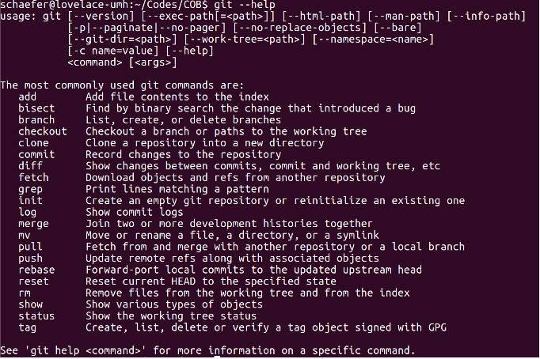
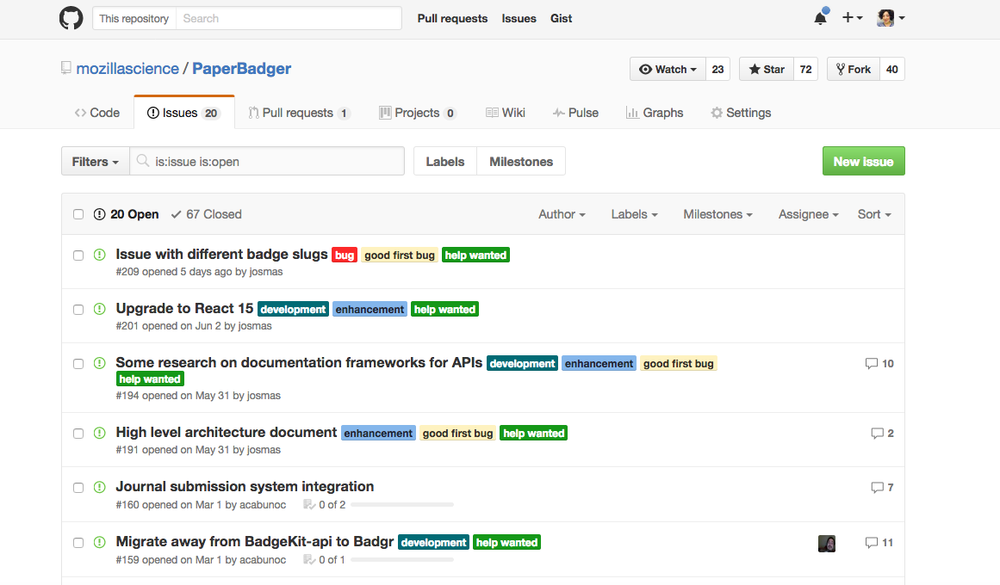

## Conhecendo o GitHub ## 

Há muito o que saber sobre o GitHub: possui ótimos recursos de gerenciamento de projetos, uma plataforma social e ferramentas de comunicação que são úteis para qualquer projeto onde um grupo de pessoas esteja trabalhando juntos no mesmo conjunto de documentos.

** Por conta do GitHub ser online, ele foi projetado para compartilhar seu trabalho e permitir que pessoas “forkem” seu projeto -- ou seja, permite que criem cópias do seu trabalho para testar, modificar e reusar bem como sentirem necessidade.**

Isso é exatamente o que você fará para criar um site para o seu grupo - você vai pegar o Repo do Grupo de Estudos e fazer uma cópia no seu próprio espaço no GitHub (as instruções detalhadas estão abaixo, na seção sobre Atribuição de Tarefas).

Antes de ir adiante precisamos conversar um pouco sobre o Git. Como mencionado anteriormente, o Git é um software de linha de comando que age por trás do GitHub e atualmente lida com o trabalho de controle de versão. Você pode usar o Git sem necessariamente utilizar o GitHub, muitos engenheiros de software e pesquisadores fazem isto. É assim que o Git aparece para o usuário: 

Todavia, para quase todas as suas necessidades iniciais de colaboração - e para configurar seu site do grupo de estudo - você não usará diretamente a linha de comando do Git. Usará a interface da web do GitHub (com o Git executando em segundo plano). Essa interface é um pouco mais amigável:

Aqui vai um vídeo sobre uma rápida demonstração a interface do GitHub pelo Abby Cabunoc Mayes - Gerente de Engajamento de Desenvolvedor Mozilla e defensor da OpenScience. 
